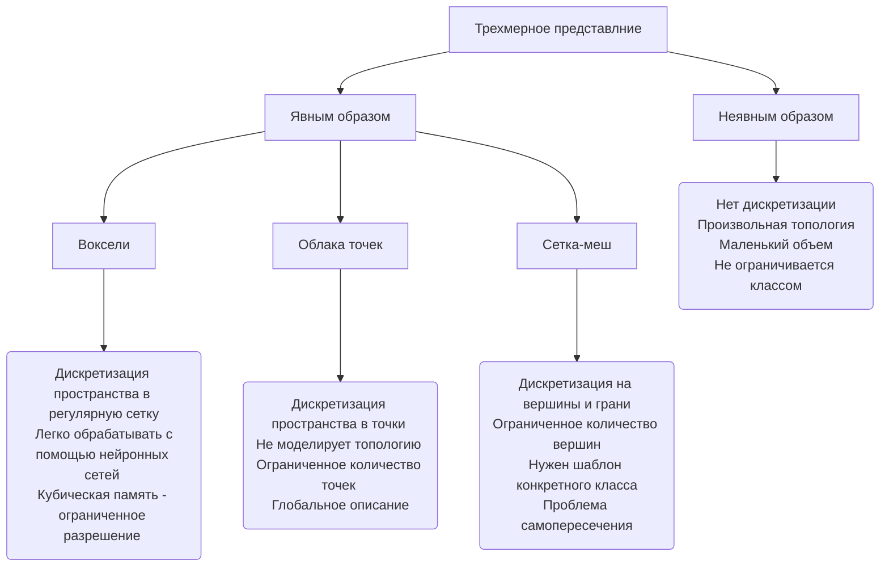

# FORMULATIONS IN PAPER

<a name="form1"/>

##### [1] 3D ShapeNets: A Deep Representation for Volumetric Shapes

Энергия сверточного слоя *E* для этой модели может быть вычислена как : 

- v_l - каждый видимый элемент
- h^f_j - каждый скрытый элемент в функцианальном канале f
- W^f - сверточный фильтр
- ∗ - означает операцию свертки

В этом определении энергии каждая видимая единица v_l связана с уникальным членом смещения b_l, чтобы облегчить реконструкцию, и все скрытые единицы {h^f_j} в одном канале свертки имеют один и тот же член смещения c^f.

