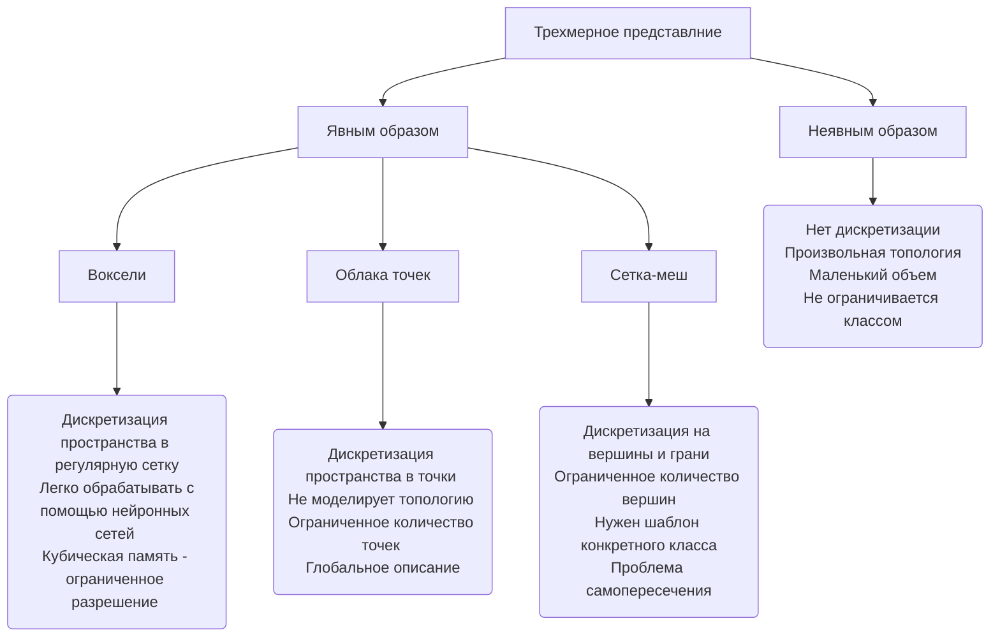

# UNRELATED SCHEMAS

```mermaid
graph TD;    
A[Трехмерное представлние]--> B[Неявным образом];    
A-->C[Явным образом];    
C-->D[Воксели];
C-->E[Облака точек];
C-->F[Сетка-меш];
D-->G(Дискретизация пространства в регулярную сетку<br> Легко обрабатывать с помощью нейронных сетей <br>Кубическая память - ограниченное разрешение <br>);
E-->H(Дискретизация пространства в точки <br>Не моделирует топологию <br>Ограниченное количество точек <br>Глобальное описание)
F-->I(Дискретизация на вершины и грани<br>Ограниченное количество вершин<br>Нужен шаблон конкретного класса<br>Проблема самопересечения)

B-->J(Нет дискретизации<br>Произвольная топология<br>Маленький объем<br>Не ограничивается классом)

```

